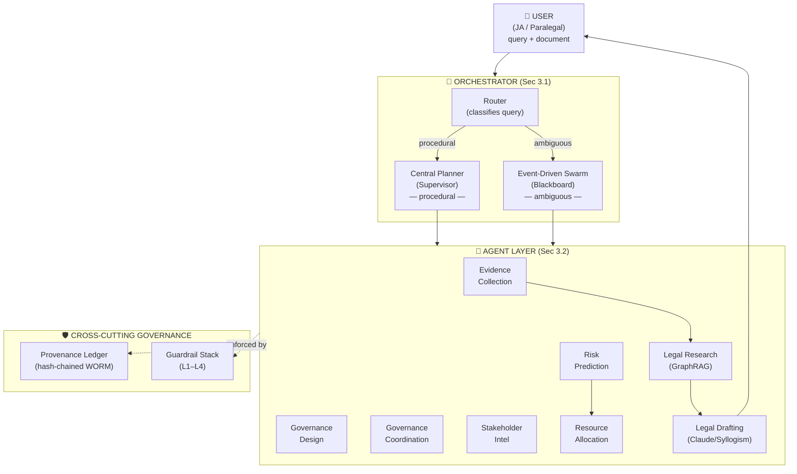
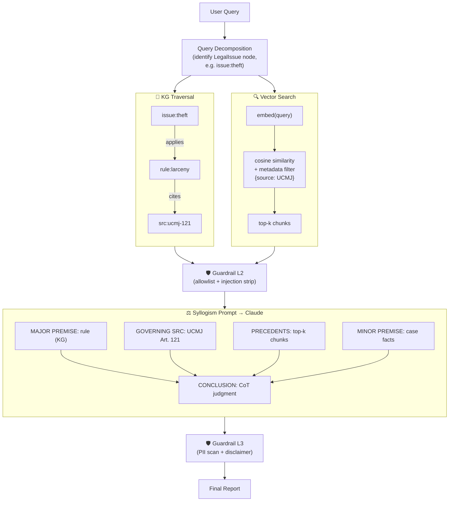
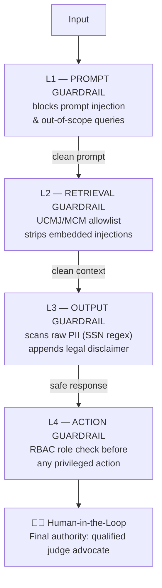
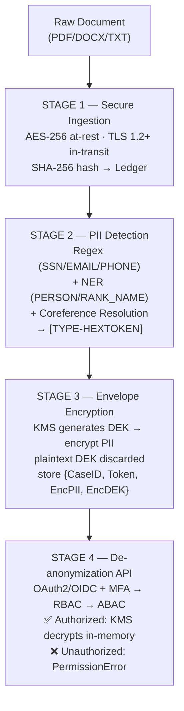
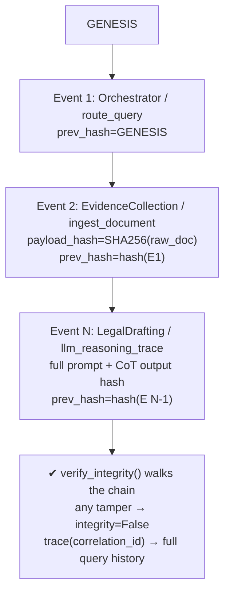
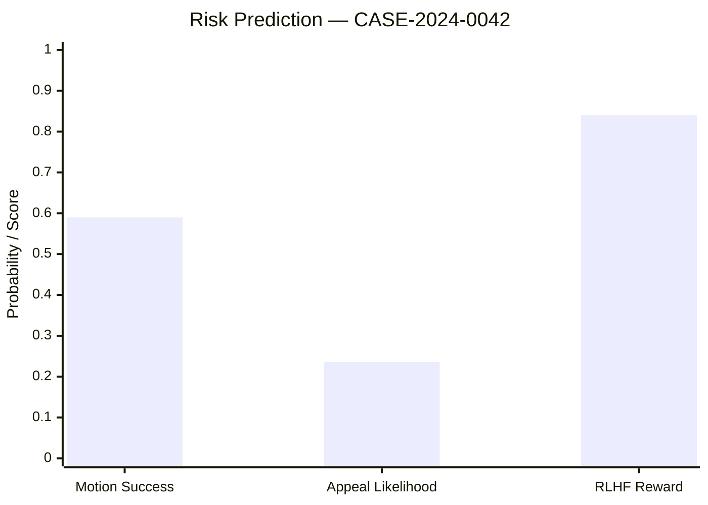

# Project Medusa — Executive Overview & Visualizations

## 1. What It Is (In Plain Terms)

**Project Medusa** is a reference implementation of a **multi-agent AI legal assistant** purpose-built for **military lawyers (Judge Advocates)** working under the **Uniform Code of Military Justice (UCMJ)** and the **Manual for Courts-Martial (MCM)**.

Its core thesis is simple but powerful:

> Automate the **data-intensive grunt work** (document ingestion, PII handling, research, risk scoring, resource planning) so that scarce human legal expertise is reserved for **judgment, strategy, and final decisions**.

Critically, it is **decision-*support*, not decision-*making*** — every output carries a mandatory disclaimer and requires sign-off by a qualified judge advocate [1].

---

## 2. The Big Picture (System Architecture)

---

## 3. The Eight Specialized Agents

| Agent | Role | Powered By |
|-------|------|-----------|
| **Evidence Collection** | Secure document ingestion & PII pseudonymization | PseudoKG, Regex+NER |
| **Governance Design** | Structures case workflow / process design | Heuristics |
| **Governance Coordination** | Coordinates cross-agent execution | Orchestrator logic |
| **Stakeholder Intel** | Witness / party intelligence gathering | KG traversal |
| **Risk Prediction** | Forecasts motion success & appeal likelihood | XGBoost + SHAP |
| **Resource Allocation** | Optimizes attorney/paralegal staffing | Constraint heuristic |
| **Legal Research** | Retrieves rules, sources, precedents | GraphRAG (KG + Vector) |
| **Legal Drafting** | Produces syllogistic legal reasoning | Claude + Legal Syllogism Prompting |

---

## 4. Signature Capability — GraphRAG + Legal Syllogism

The intellectual heart of Medusa is its **two-pronged retrieval** feeding a **structured syllogistic prompt** [1].

The reward model behind continuous improvement is formalized as:

$$ R_{total} = 0.7 \cdot R_{accuracy} + 0.3 \cdot R_{utility} - 0.3 \cdot \mathbb{1}[\text{critique} \neq \text{NONE}] $$

where $$ R_{accuracy} = \frac{\text{avg}(\text{Legal Accuracy},\ \text{Citation Quality})}{5} $$ and $$ R_{utility} = \frac{\text{avg}(\text{Clarity},\ \text{Completeness})}{5} $$ [1].

---

## 5. Defense-in-Depth — The Four Guardrail Layers

---

## 6. PII Protection — Envelope Encryption Pipeline

> **Access rule:** De-anonymization requires `role=CaseLead` **AND** `assigned_cases ∋ CaseID` **AND** MFA — all three must hold [1].

---

## 7. Trust & Auditability — Hash-Chained Provenance Ledger

Each entry stores **actor, action, timestamp, rationale, and SHA-256 of I/O** — making every agent decision independently verifiable [1].

---

## 8. Live Demo Snapshot — CASE-2024-0042

The bundled dashboard run produces a fully traceable case analysis:

| Dimension | Result |
|-----------|--------|
| **Query** | Analyze Article 121 elements & assess motion-to-dismiss success |
| **Coordination mode** | `central_planner` |
| **P(motion success)** | **0.590** |
| **Appeal likelihood** | 0.236 |
| **Predicted complexity** | high |
| **Top SHAP driver** | `mentions_intent` (+0.300) |
| **Resource recommendation** | 3 attorneys, 2 paralegals → **proceed_to_trial** |
| **RLHF reward** | 0.840 |
| **Ledger integrity** | ✅ Valid (12 chained events) |

---

## 9. From Prototype to Production

A key design strength is that the core engine runs on **Python standard library only** — every external dependency is a clean swap-in:

| Stub Component | Production Replacement |
|---------------|------------------------|
| `ClaudeClient` | Anthropic Claude API |
| `LegalBERTEmbedder` | LegalBERT / sentence-transformers |
| `EmulatedKMS` | AWS KMS / Azure Key Vault |
| `KnowledgeGraph` | Neo4j / Amazon Neptune |
| `VectorStore` | Pinecone / Weaviate / pgvector |
| PII detection regex | Microsoft Presidio / AWS Macie |
| `ProvenanceLedger` | AWS S3 + Object Lock (WORM) / blockchain |

---

## 10. Why It Matters — Key Takeaways

- **🎯 Mission-fit:** Tailored to the *specific* statutory framework (UCMJ/MCM) military lawyers actually operate under.
- **🧠 Augmentation, not replacement:** Structured syllogistic reasoning supports — never supplants — human judgment.
- **🔐 Security-first:** Envelope encryption, multi-factor de-anonymization, and least-privilege access are baked in.
- **📜 Fully auditable:** Hash-chained WORM ledger makes every AI action defensible and tamper-evident — essential for legal contexts.
- **🛡️ Defense-in-depth:** Four guardrail layers + mandatory human-in-the-loop.
- **🚀 Deploy-ready architecture:** Clean stub→production swap path with named enterprise/cloud targets.

---

### Reference

[1] Project Medusa v1.0.0 — README & Architecture Diagram (Sec 2–6), *Multi-Agent Legal Assistant for Military Justice (UCMJ/MCM)*.

---

Would you like me to take this further? I can produce:
- A **PowerPoint deck** of this overview for stakeholder briefings,
- A **one-page executive summary** suitable for leadership,
- Or a deeper technical drill-down on any single component (e.g., the GraphRAG retrieval or the RLHF reward design).

Just let me know which direction would be most useful. 😊
